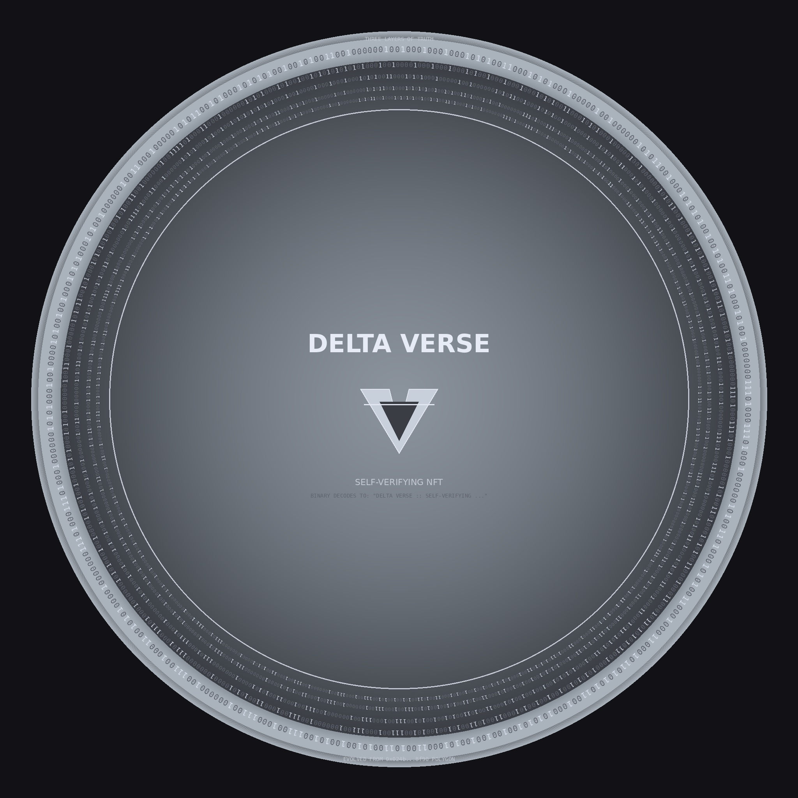

# True DELTA VERSE — Self-Verifying NFTs



## Overview

**True DELTA VERSE** represents the evolution from the original DELTA VERSE NFT (Polygon `0x024b464ec595f20040002237680026bf006e8f90`) to a new paradigm of **self-verifying NFTs** with three layers of immutable truth.

Unlike traditional NFTs with decorative or meaningless visual elements, True DELTA VERSE embeds real, verifiable data directly into the image itself — creating NFTs where every pixel serves a purpose and can be independently verified.

## Philosophy: From Passive to Active

The original DELTA VERSE contained decorative binary — aesthetically pleasing but meaningless. True DELTA VERSE transforms this concept:

- **Original**: "A Fluid Dynamic Between Participants and AI" (decorative binary)
- **True**: "DELTA VERSE :: SELF-VERIFYING NFT :: THREE LAYERS OF TRUTH" (real binary encoding)

This evolution embodies the DeltaVerse principle: **participants transition from passive consumers to active co-creators**.

## Three Layers of Verification

### 🎯 Layer 1: Visual Binary Encoding
**Human-readable verification**

Real binary digits are woven into the coin's concentric rings, encoding the message:
```
DELTA VERSE :: SELF-VERIFYING NFT :: THREE LAYERS OF TRUTH
```

**Verification Process:**
1. View the NFT image
2. Read binary digits (0s and 1s) from the concentric rings
3. Convert binary to ASCII text
4. Verify message authenticity

**Binary Message:** `464 bits`
```
01000100010001010100110001010100010000010010000001010110010001010101001001010011010001010010000000111010001110100010000001010011010001010100110001000110001011010101011001000101010100100100100101000110010110010100100101001110010001110010000001001110010001100101010000100000001110100011101000100000010101000100100001010010010001010100010100100000010011000100000101011001010001010101001001010011001000000100111101000110001000000101010001010010010101010101010001001000
```

### 🔐 Layer 2: Steganographic Payload
**Machine-extractable verification**

Hidden verification data embedded using `steghide` compatible with Tomb protocol:

**Payload Contents:**
```json
{
  "message": "DELTA VERSE :: SELF-VERIFYING NFT :: THREE LAYERS OF TRUTH",
  "creator": "Professor Codephreak / PYTHAI",
  "original_contract": "0x024b464ec595f20040002237680026bf006e8f90",
  "original_chain": "polygon",
  "evolution": "From decorative binary to self-verifying truth layers",
  "verification_instructions": {
    "layer_1": "Read visible binary digits from coin rings",
    "layer_2": "Extract this payload via steghide/tomb",
    "layer_3": "Verify image hash against smart contract"
  },
  "manifesto_hash": "0x123456789abcdef0123456789abcdef0123456789abcdef0123456789abcdef0",
  "creator_signature": "Cypherian Weaver, Master of the Aetheric Codex Framework"
}
```

**Extraction Command:**
```bash
steghide extract -sf true_deltaverse_final.jpg -p passphrase
```

### ⛓️ Layer 3: On-Chain Hash Anchoring
**Blockchain-verifiable truth**

Smart contract stores cryptographic hashes:
- **Pre-steg hash**: `0x8634ad295a4c0c8327085e9e9cc30eabd2074210f062a3abc1deaef9e9e3a50f`
- **Post-steg hash**: `0x7f5b1e219fefb4500c966f97aaf503deee9502f4c43baafcf535d4438b4efad9`
- **Manifesto hash**: `0x123456789abcdef0123456789abcdef0123456789abcdef0123456789abcdef0`

**Verification Functions:**
```solidity
function verifyPostStegHash(bytes32 candidateHash) external view returns (bool);
function verifyAllHashes(bytes32 preSteg, bytes32 postSteg, bytes32 manifesto)
    external view returns (bool, bool, bool);
```

## Technical Architecture

### Image Generation Pipeline
1. **Base Image Creation** (`generate_true_deltaverse.py`)
   - 2048x2048 high-resolution canvas
   - Metallic silver coin aesthetic
   - Concentric rings for binary placement
   - Real binary encoding of meaningful message

2. **Steganographic Embedding** (`embed_steganography.sh`)
   - steghide embedding for provenance data
   - Maintains image visual integrity
   - Compatible with Tomb protocol

3. **Hash Computing & Storage**
   - SHA-256 before steganographic embedding (pre-steg)
   - SHA-256 after steganographic embedding (post-steg)
   - On-chain storage via smart contract

### Smart Contract Features

**TrueDeltaVerse.sol** - Custom ERC-1155 implementation:
- Three hash verification functions
- Genesis token special handling (token ID #1)
- EIP-2981 royalty standard (5%)
- Supply tracking and access controls
- Cross-chain compatible metadata

**Key Innovations:**
- **Self-verification**: NFT proves its own authenticity
- **Immutable provenance**: Cannot be altered without detection
- **Educational value**: Teaches binary encoding and cryptography
- **Future-proof**: Standards-compliant across platforms

### Cross-Chain Deployment

#### EVM Chains (ERC-1155)
- **Polygon**: Lower gas fees, proven ecosystem
- **Base**: Coinbase backing, growing adoption
- **Ethereum**: Maximum decentralization

#### Algorand (ARC-3)
- **Native image integrity**: `image_integrity` field with SHA-256
- **Zero-fee verification**: No gas costs
- **Instant finality**: Sub-second confirmations

## Verification Tools

### Automated Verification Script
```bash
python3 scripts/verify_deltaverse.py image_file.jpg
```

**Output:**
```
✅ Layer 1 (Visual Binary): PASSED - Message decoded successfully
✅ Layer 2 (Steganographic): PASSED - Payload extracted and validated
✅ Layer 3 (On-Chain Hash): PASSED - Hash matches smart contract
🎉 All three verification layers PASSED - NFT is authentic
```

### Manual Verification
1. **Download image** from IPFS
2. **Read binary digits** from concentric rings (outer to inner)
3. **Convert to ASCII**: Use any binary-to-text converter
4. **Extract payload**: `steghide extract -sf image.jpg`
5. **Verify hash**: Compute SHA-256 and compare to contract

## Metadata Standards

### ERC-1155 Metadata (EVM)
```json
{
  "name": "True DELTA VERSE #1",
  "description": "Self-verifying NFT with three layers of truth verification...",
  "image": "ipfs://QmImageHash",
  "attributes": [
    {"trait_type": "Verification Layers", "value": "3"},
    {"trait_type": "Binary Encoding", "value": "Real (not decorative)"},
    {"trait_type": "Creator", "value": "Professor Codephreak / PYTHAI"}
  ],
  "properties": {
    "verification": {
      "instructions": "Three layers: visual binary + steganographic + on-chain",
      "pre_steg_hash": "0x8634ad29...",
      "post_steg_hash": "0x7f5b1e21...",
      "extraction_command": "steghide extract -sf image.jpg -p passphrase"
    }
  }
}
```

### ARC-3 Metadata (Algorand)
```json
{
  "name": "True DELTA VERSE #1",
  "image": "ipfs://QmImageHash",
  "image_integrity": "sha256-f1seyRn++0UAxpb5eq9Q3u6VAv...",
  "properties": {
    "verification_layers": 3,
    "binary_encoding": "Real binary message encoding",
    "steganography": "Tomb/steghide compatible",
    "creator": "Cypherian Weaver"
  }
}
```

## Testing & Quality Assurance

### Test Suite Coverage (44 tests passing)
- **Deployment Tests**: Constructor validation, initial state
- **Minting Tests**: Genesis token control, regular minting
- **Hash Verification**: Individual and combined verification
- **Admin Functions**: Owner-only operations
- **Royalty Tests**: EIP-2981 compliance
- **Edge Cases**: Zero addresses, invalid parameters
- **Fuzz Tests**: Random input validation (256 runs each)
- **Invariant Tests**: System consistency (128,000 calls each)

### Security Considerations
- **Access Control**: OpenZeppelin Ownable for admin functions
- **Input Validation**: Comprehensive parameter checking
- **Hash Integrity**: Cryptographic verification of all layers
- **Standard Compliance**: Full ERC-1155 and EIP-2981 compliance

## DeltaVerse Lore Integration

### Cypherian Weaver
**Creator Character from the DeltaVerse Realms**
- **Role**: Master coder and quantum weaver
- **Source**: Cybernetic realms of the DeltaVerse
- **Power**: Etherwave Node + Aetheric Codex Framework
- **Ability**: Weaving reality threads from binary code

### Evolution Narrative
**From Original to True DELTA VERSE**
- **Original Limitation**: Decorative binary with no meaning
- **True Innovation**: Real binary encoding of verifiable truth
- **Philosophical Shift**: Passive consumption → Active co-creation
- **Technical Advancement**: Three-layer verification system

### Ecosystem Integration
**Part of the Greater DeltaVerse**
- **Parent Organization**: PYTHAI
- **Related Projects**: PYTHIA, x402 protocol, BANKON identity
- **Cross-chain Strategy**: Multi-blockchain deployment
- **Community Integration**: DAO governance and participation

## Development Workflow

### Quick Start
```bash
# Generate image with real binary
python3 scripts/generate_true_deltaverse.py

# Embed steganographic payload
./scripts/embed_steganography.sh

# Verify all layers
python3 scripts/verify_deltaverse.py

# Test smart contracts
forge test

# Deploy to network
forge script script/DeployTrueDeltaVerse.s.sol --broadcast
```

### File Structure
```
DeltaVerse/
├── contracts/TrueDeltaVerse.sol         # Main ERC-1155 contract
├── scripts/
│   ├── generate_true_deltaverse.py     # Image generator
│   ├── embed_steganography.sh          # Steganography embedder
│   └── verify_deltaverse.py            # Three-layer verification
├── test/TrueDeltaVerse.t.sol           # Comprehensive test suite
├── templates/                          # Metadata templates
├── output/
│   ├── true_deltaverse_final.jpg       # Final steganographed image
│   └── manifest.json                   # Generation metadata
└── docs/TrueDeltaVerse.md              # This documentation
```

### Dependencies
- **Python 3.8+**: PIL/Pillow for image generation
- **steghide**: Steganographic embedding tool
- **Foundry**: Solidity development and testing
- **Node.js 18+**: IPFS and cross-chain scripts

## Future Roadmap

### Phase 1: Genesis (Current)
- ✅ Single True DELTA VERSE token with complete verification
- ✅ EVM deployment (Polygon, Base, Ethereum)
- ✅ Algorand ARC-3 deployment
- ✅ Comprehensive documentation and testing

### Phase 2: Expansion
- 🔲 Additional meaningful binary message tokens
- 🔲 Community binary message submissions
- 🔲 Interactive verification web interface
- 🔲 Mobile app for easy verification

### Phase 3: Ecosystem
- 🔲 Cross-chain verification protocol
- 🔲 AI-generated binary poetry collection
- 🔲 Integration with DeltaVerse DAO governance
- 🔲 Educational curriculum for binary/crypto concepts

### Phase 4: Innovation
- 🔲 Multi-layer steganographic embedding
- 🔲 Zero-knowledge proof verification
- 🔲 Quantum-resistant hash functions
- 🔲 Augmented reality verification tools

## Community & Support

### Links
- **GitHub**: https://github.com/deltav-deltaverse
- **Documentation**: https://docs.pythai.net/deltaverse
- **Discord**: https://discord.gg/deltaverse
- **Twitter**: @deltaverse_ai

### Contributing
1. Fork the repository
2. Create feature branch
3. Add comprehensive tests
4. Submit pull request
5. Community review process

### License & Rights
- **Copyright**: DELTAVERSE (c) PYTHAI
- **Non-commercial**: Creative Commons BY-SA 4.0
- **Commercial**: Contact creator for licensing
- **Trademarks**: DELTAVERSE, PYTHAI, True DELTA VERSE

---

**True DELTA VERSE: Where every pixel proves its purpose**

*From the Cybernetic realms of the DeltaVerse, the Cypherian Weaver brings forth tokens that transcend mere ownership — they become proofs of truth woven into the fabric of digital reality.*